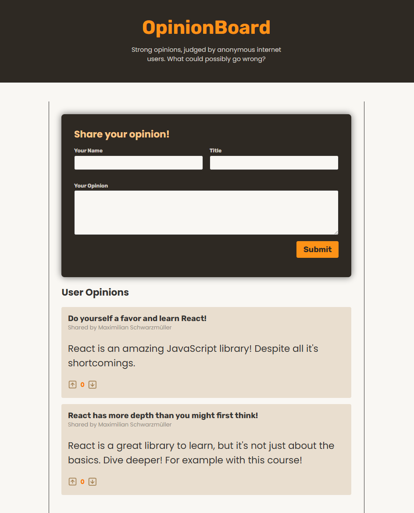

# Opinion Sharing App with Voting System

A React app that allows users to share their opinions, vote on other opinions, and view opinions shared by others. The app includes functionality for submitting new opinions, upvoting or downvoting opinions, and displaying the current state of opinions, including votes. It integrates a backend API using Express to store and manage opinions, while React is used for handling the frontend logic, including form validation, state management, and displaying dynamic content.
This project demonstrates the use of custom hooks, context, and asynchronous actions to manage form submissions, handle user interactions, and perform optimistic updates for the votes.
<br><br>


## 🚀 Getting Started

### **Prerequisites**
Make sure you have the following installed before running the project:
- **Node.js** (Download from [nodejs.org](https://nodejs.org/))
- **npm** or **yarn** (Comes with Node.js)
<br>

### **Installation**
1. Clone this repository:
   ```sh
   git clone https://github.com/nathenpriyonggo/react-forms-opinion-board
   ```
2. Navigate to the directory
   ```sh
   cd react-forms-opinion-board
   ```
3. Install dependencies:
   ```sh
   npm install
   ```
4. Start the development server:
   ```sh
   npm run dev
   ```
5. Open ```http://localhost:5173/``` in your browser.
<br>

## 🛠️ Built With
- **React** - A JavaScript library for building user interfaces
- **Vite** - A fast build tool for modern web projects
- **Express** - A backend framework for handling HTTP requests
- **React Context** – For managing global state (opinions and voting)
- **Custom Hook** - useActionState for managing form state and validation
- **Validation Functions** - Simple validation functions for checking title, opinion length, and user name
<br>

## 🎮 App Features
- **Opinion Submission** - Users can share their opinion, including a title and body text, through a form with validation.
- **Upvote and Downvote** - Users can upvote or downvote opinions, with votes being managed optimistically for better UX.
- **Real-time Voting Updates** - The app uses optimistic updates for voting, so the vote count is updated immediately even before the server confirms.
- **Form Validation** - Ensures the title is at least 5 characters long, the opinion is between 10 and 300 characters, and the user name is provided.
- **Error Handling** - If any validation errors occur or the server request fails, appropriate error messages are displayed to the user.
- **Responsive UI** - The app's design adapts to different screen sizes for a seamless experience on both mobile and desktop.
- **Backend API** - Uses Express and Node.js to manage opinions, with endpoints for adding, upvoting, and downvoting opinions.
<br>


## 🖥️ Preview
<p align="center"></p>
<br>

## 📜 License
This project is open-source. Feel free to fork, modify, and expand upon it!
<br><br>


---

✨ Happy coding! 🚀
